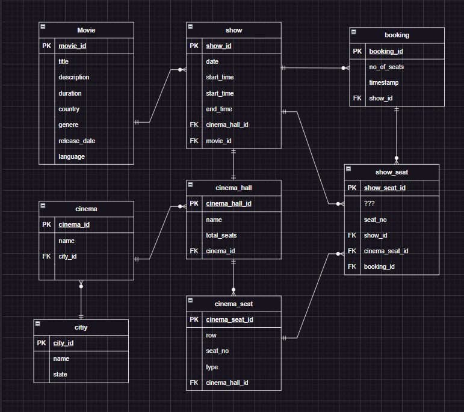

# Problem Solving Case: bookmyshow

**Problem:**

> Bookmyshow is a ticketing platform where you can book tickets for a movie show. As part of this problem, we need to build API’s for the following feature. As a user, I can select any theatre in the city. On selecting the theatre, I should be able to see the dates of next 7 days. I can click on any date and the page should load to give me all the movies in that theatre on that given date. Movies should contain details of all the showtimes.

> Create an API to book seats for you and you friend for a given theatre and a show. 
Constraint: No two people should be able to book same seat at the same time for the same show. 
The API that loads data for all shows on a given date has become slow. Which columns would you index to improve the performance of the API ? Why ?  
You have noticed that even after indexing the columns the API speed isn’t under 100 ms. Update the code of existing API to cache the appropriate data in the redis.  

> Implement code for quick retrieval of static movie data - Name, Cast, Crew, Movie Plot, Runtime, Language, Genre, etc.  
Build an endpoint for storing and retrieval of comments and ratings for a given movie. Which database would you choose and why? 
Build an endpoint where one can search for movies and theatres.
Implement language (Hindi, English, Kannada, Telugu etc.) and genre (Romantic, Action, Scifi). 


## See it in action:

### Setup with Docker

- Make sure you have created .env file after cloning the repo and copy the contents from `env.example` file.
```
git clone https://github.com/PanicLion/bookmyshow-problem-solving-case.git

cd bookmyshow-problem-solving-case

docker-compose up
```
### Setup without Docker

- Create a ```.env``` file and update the fields mentioned in [env.example file](./env.example)

- If you havn't setup a authentication for elasticsearch then run ``` elasticsearch-reset-password.bat -u elastic ``` from your elasticsearch bin directory. Note that 'elastic' is a default user.

- Install dependecies
``` npm install ```

- Start your redis-server
``` sudo service redis-server start ``` (In Linux / WSL)

- Start your elasticsearch ``` elasticsearch.bat ``` from your elasticsearch bin directory.

- Start the server
``` npm start ```

- Open your browser and try these REST endpoints (<i>Interactive</i>):
    - ``` http://localhost:3000/ ``` (GET) you list of cities
    - ``` http://localhost:3000/city/:cityId/cinemas ``` (GET) you list of cinemas for the city you chose
    - ``` http://localhost:3000/:cityId/:cinemaId ``` (GET) you the next 7 days (including today's) to choose shows for
    - ``` http://localhost:3000/:cityId/:cinemaId/:date ``` (GET) you the list of shows available for the chosen cinema & date
    
- endpoints for ticket booking
    - ``` http://localhost:3000/shows/:showId/seatlayout ``` (GET) you layout of available seats for the showId.

    - ``` http://localhost:3000/booktickets/:showId/:date ``` (POST) booking information and returns show and seat details.
        - ``` 
            // req.body

            {
                "no_of_seats": 2,
                "seats": ["A1", "D2"]
            } 

- endpoint for searching movies/cinemas
    - ``` http://localhost:3000/search?text=keyword ``` (GET)

    - ``` http://localhost:3000/movies/:id ``` (GET)

- endpoint for searching movies with filters
    - ``` http://localhost:3000/movies?language=english|hindi&genere=horror|comedy ``` (GET)
    - from and size filter can also be used to limit the search results.

- endpoints for comments
    - ``` http://localhost:3000/movies/:id/comments ``` (GET) you comments for the movie with 'id'

    - ``` http://localhost:3000/movies/:id/comments ``` (POST) adds a comment for a movie with 'id'
        - ```
            // req.body
            {
                "comment": "Maybe you have watch some different movie.",
                "parentId": "1"
            }

## Schema:

### This is the schema we'll be creating




> The data being populated in these tables are for the dates from 2023-05-20 to 2023-05-26. But with update queries it will be updated to current and future dates.


