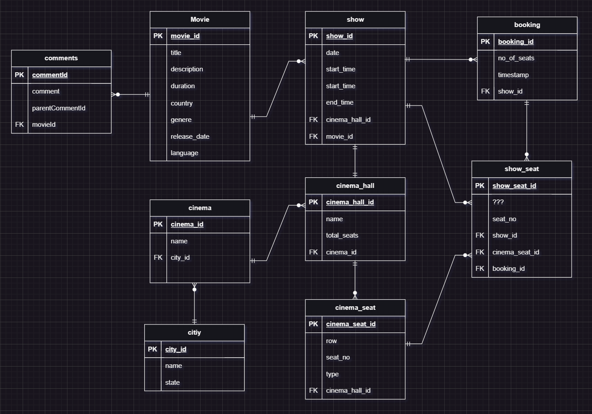

# Problem Solving Case: bookmyshow

**Problem:**

> Bookmyshow is a ticketing platform where you can book tickets for a movie show. As part of this problem, we need to build API’s for the following feature. As a user, I can select any theatre in the city. On selecting the theatre, I should be able to see the dates of next 7 days. I can click on any date and the page should load to give me all the movies in that theatre on that given date. Movies should contain details of all the showtimes.

## How To Setup:

- Create a ```.env``` file and update the fields mentioned in [env.example file](./env.example)

- Install dependecies
``` npm install ```
- Setup DB (**run before starting the server**)
``` npm run setup-db ```
- Start the server
``` npm start ```

## Schema:

### This is the schema we'll be creating



### You'll find the sql script for creating and populating the above schema with dummy values [here.](./sql_script.sql)

> The data being populated in these tables are for the dates from 2023-05-20 to 2023-05-26.


